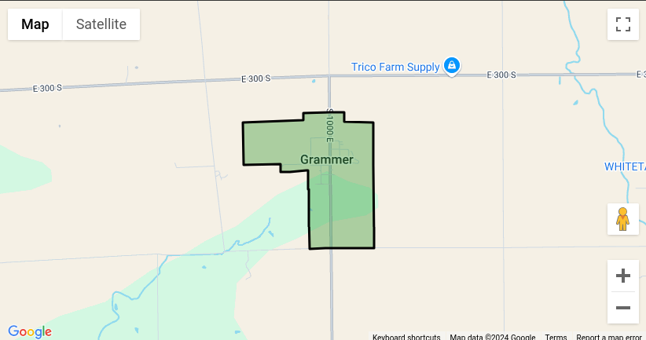

# Zipcode Polygon Map Project

We are going to create a zipcode polygon map using the data from the US Census Bureau. The data is available in the form of a shapefile. We will use the `geopandas` library to read the shapefile and plot the polygons on a map.

## Steps

1. Read the shapefile using the `geopandas` library.
2. Plot the polygons on a map.
3. Customize the map by adding within the polygon shapes the label of the zip code that it represents.

## Data

The data is available in the form of a shapefile. You can download the shapefile from the US Census Bureau website. The shapefile contains the polygons for each zip code in the United States.

Current location: https://www.census.gov/cgi-bin/geo/shapefiles/index.php?year=2023&layergroup=ZIP+Code+Tabulation+Areas
Current size: 503.8 MB (Oct 2, 2024) (zipped)

Unzip the data into the `census_data/` directory

## Formatting the data

Ensure that the files that are defined in the `index.js` in the following lines:

```javascript
const shapefilePath = "./census_data/tl_2023_us_zcta520.shp";
const dbfFilePath = "./census_data/tl_2023_us_zcta520.dbf";
```

are adjusted for the files that are in the `census_data/` directory.

Running `node index.js` should now generate two outputs `output.geojson` file that contains all of the Census Zip data converted into a Geojson format and a `output.json` file that is a series of JSON objects broken up by `\n` breaks to make it easier to stream the file and convert the line back into a JSON object later on.

The `output.geojson` file will be roughly ~1.2GB in size.

Use `less output.geojson` to view the file (if needed).

## Extracting the data

Using `jq`, you can specify a zipcode to return back only the geometry of the zip code.

```
jq '.features[] | select(.properties.zipCode == "22031") | .geometry' output.geojson`
```

### Immediately insert the data to a Postgres database

It is optional if you want to immediately store the data in a database.

`docker-compose.yml` will stand up a basic Postgres container with the PostGIS extension enabled. The `init.sql` file will create the table `zipcode_polygons_table`;

```bash
docker-compose up -d
INSERT_TO_POSTGRES=true && node index.js
```

## Visualizing the data

Under the `site/index.js` file, the `customCoordinates` should now be filled in by the `geometry` data that was parsed from the earlier step.

Example of the data being visualized can be found here: https://jsfiddle.net/mcry9o1z/31/

Screenshot example:

